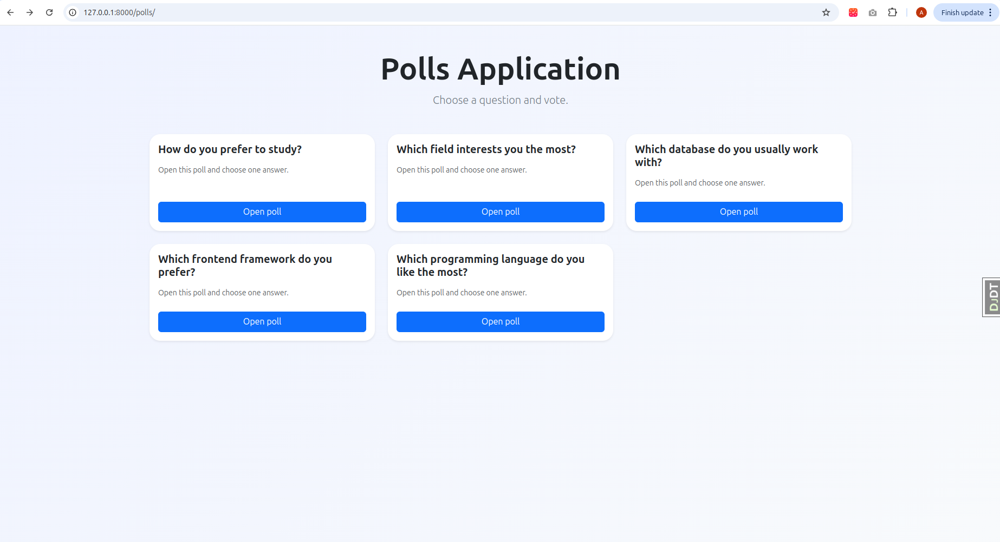
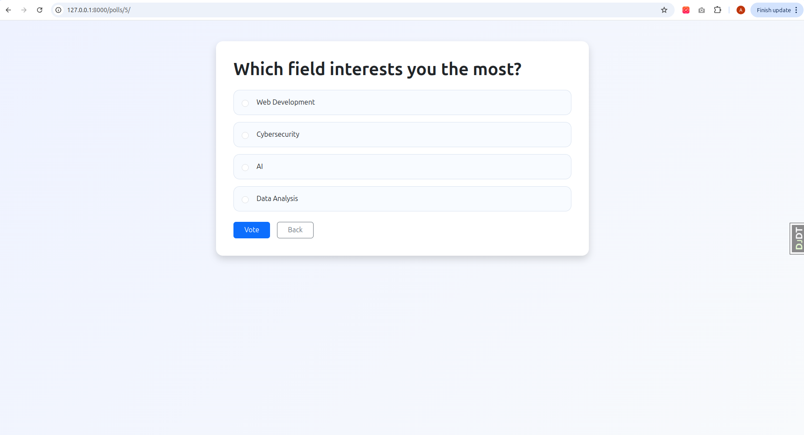
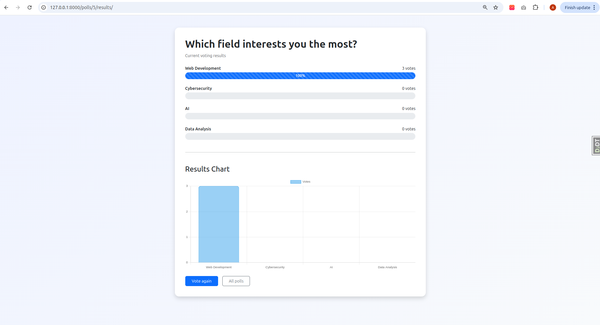
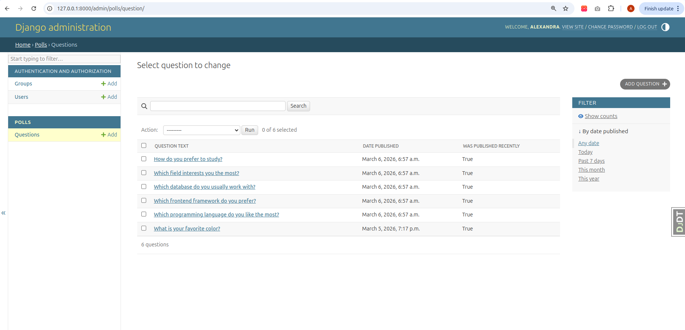

# Django Polls Application


## Project Overview

This project is a web application built with Django.

It allows users to:
- view polls
- vote for answers
- see voting results

The project is based on the official Django tutorial and extended with a modern frontend interface.

---

## Features

- Display poll questions
- Vote for answers
- View voting results
- Progress bars for vote distribution
- Results chart using Chart.js
- Responsive Bootstrap design
- Poll management through Django Admin

---

## Technologies

- Python
- Django
- HTML
- CSS
- Bootstrap 5
- Chart.js
- SQLite

---

## Screenshots

### Home Page



### Poll Page



### Results Page



### Django Admin



---

## Project Structure

The project contains two main parts.

The **mysite** directory contains the main Django configuration files.

The **polls** application contains the core functionality of the project, including:

- models describing poll questions and answer choices
- views handling user interaction
- URL routing
- templates used to render pages
- static files for styling

Templates are located in:

templates/polls/

Static styles are located in:

static/polls/style.css

Screenshots used in the documentation are stored in the **images** directory.

The file **manage.py** is used to run Django management commands.

---

## Installation

Clone the repository

```bash
git clone https://github.com/YOUR_USERNAME/YOUR_REPOSITORY.git
cd YOUR_REPOSITORY
```

Create virtual environment

```bash
python3 -m venv .venv
source .venv/bin/activate
```

Install dependencies

```bash
pip install django
```

Apply migrations

```bash
python manage.py migrate
```

Run server

```bash
python manage.py runserver
```

Open in browser

http://127.0.0.1:8000/polls/

Admin panel

http://127.0.0.1:8000/admin/

---

## Author

Oleksandra Adamchyk